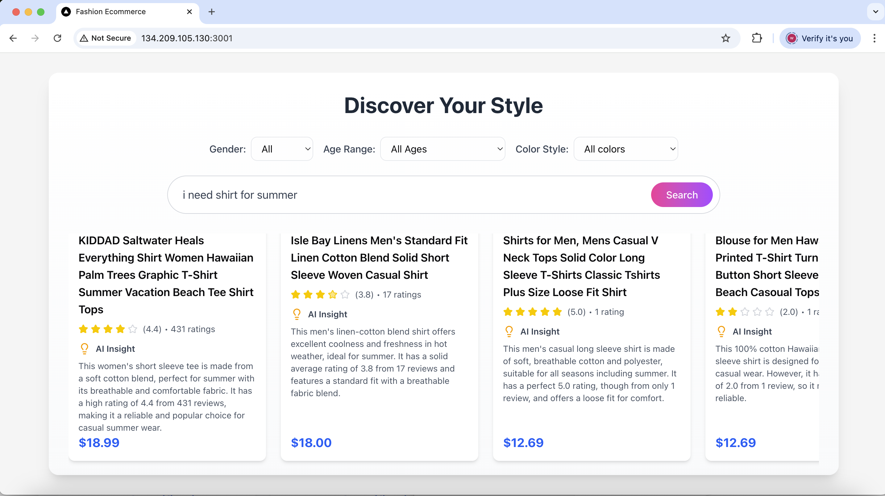
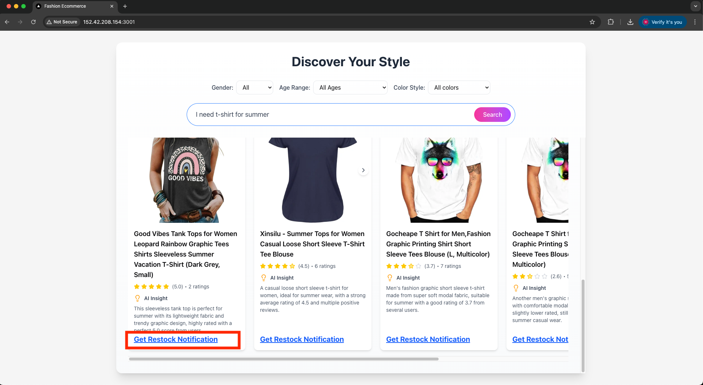
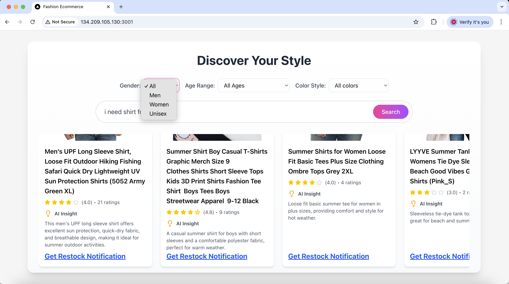

# OpenAI Assignment

## Demonstration of Skills

### Technical skills 
1. **Fullstack Prototype development** that translates abstract idea into workable fullstack application
2. **Customer-centric and creative thinking** involving strategic product presentation, personalized search and recommendations to enhance customer engagement and increase sales
3. **Strategic application of OpenAI models and techniques** in title/feature extraction, semantic similarity search, AI-powered reranking of products and personalized recommendation reason generation, ensuring structured output through precise prompting, strategic selection of product data for embedding vectorization to optimize semantic search performance
4. **Data Science skills** in data handling (Exploratory Data Analysis, data cleansing, feature engineering, handling missing value), hypothesis formulation, and strategic planning (separation of in-stock and out-of-stock products based on price availability)
5. **Accelerate process speed** through strategic database indexing, batch embedding and multiprocessing technique
6. **Rapid development** of user-friendly and visually appealing frontend to showcase application functionality, with creative titles and engaging messaging
7. **Modern software development practices** including Agile development, version control, API based microservices architecture, Docker containerization, unit testing, Object-Oriented Programming, environment separation (production/development), strict data type validation, comprehensive environment and settings management, thorough logging, and well-structured repository
8. **LLM application safeguarding and security** through strict and thorough query validation on both frontend and backend, implementing proper CORS policies to control cross-origin access and prevent unauthorized requests
9. **Easy-to-deploy repository** with minimal commands required to set up both frontend and backend services

### Soft skills
1. **Demonstrated client engagement** by proactively asking critical questions to HR (who played the role of client) regarding data handling strategy and application requirements
2. **Pay attention to client expectations**(application requirements) to ensure satisfactory deliverable
3. **Strategic scheduling** involving selective function implementation and optimal trade-offs between features to ensure timely delivery
4. **Ability to pay attention to small details** throughout the development process to ensure high-quality deliverable
5. **Effective presentation and documentation skills** demonstrated through comprehensive README creation and professional project showcasing to impress clients and stakeholders

## Application preview

### User Journey Through the Application

#### 1. Search Box


#### 2. In Stock Product Recommendation
*Dynamic search results showing semantic similarity search capability and AI-powered product recommendations with relevant matches.*


#### 3. Out of Stock Product Recommendation
*Dynamic search results showing semantic similarity search capability and AI-powered product recommendations with relevant matches.*


#### 4. AI Insights Feature
*Recommendation reasons generated by LLM reranker based on the user query and details of products for better and personalized customer engagement experience.*


#### 5. Restock Notification
*Example of restock notification for highly recommended but out of stock products.*


#### 6. Customizable Search Options
*Easy to enter customizable search options for enhanced customer engagement, personalized search result and improved accuracy*


## Project Structure

```
.
├── backend/
│   ├── app/
│   │   ├── ai_utils/                   # AI and machine learning utilities
│   │   │   ├── __init__.py             
│   │   │   ├── embeddings.py           # Text embedding generation using OpenAI
│   │   │   └── llm_reranker.py         # LLM-based search result reranking
│   │   ├── config/                     # Application configuration
│   │   │   ├── __init__.py             
│   │   │   └── settings.py             # Environment and application settings
│   │   ├── database/                   # Database operations
│   │   │   ├── __init__.py             
│   │   │   ├── Dockerfile              # Database container configuration for database
│   │   │   ├── insert_data.py          # Product data insertion and preprocessing
│   │   │   └── vector_db.py            # Vector database operations
│   │   ├── deps/                       # Dependency injection
│   │   │   ├── __init__.py             
│   │   │   └── db.py                   # Database connection management
│   │   ├── preprocessing/              # Data preprocessing pipeline
│   │   │   ├── __init__.py             
│   │   │   ├── data_cleaning.py        # Data cleaning and normalization
│   │   │   ├── embedding_generation.py # Product embedding generation
│   │   │   ├── preprocess_pipeline.py  # Data preprocessing pipeline
│   │   │   └── product_image_feature_extraction.py # Image feature extraction
│   │   ├── schemas/                    # Data validation schemas
│   │   │   ├── __init__.py             
│   │   │   └── query_shema.py          # Search query validation
│   │   ├── utils/                      # Utility functions
│   │   │   ├── __init__.py             
│   │   │   └── logger.py               # Logging configuration
│   │   └── main.py                     # FastAPI application entry point
│   ├── tests/                          # Test suite
│   │   ├── __init__.py                 
│   │   ├── conftest.py                 # Test configuration and fixtures
│   │   └── test_search.py              # Search functionality tests
│   ├── Dockerfile                      # Backend production container
│   └── requirements.txt                # Python dependencies
│
├── frontend/
│   ├── src/
│   │   ├── components/                 # React components
│   │   │   ├── ui/                     # Reusable UI components
│   │   │   │   ├── ai-insight.tsx      # AI insight display component
│   │   │   │   ├── product-card.tsx    # Product card component
│   │   │   │   └── product-carousel.tsx # Image carousel component
│   │   │   ├── PageSkeleton.tsx        # Loading skeleton component
│   │   │   ├── SearchBox.tsx           # Search input component
│   │   │   ├── SearchForm.tsx          # Search form component
│   │   │   └── SearchResults.tsx       # Search results display
│   │   ├── services/                   # API services
│   │   │   └── api.ts                  # API client and endpoints
│   │   ├── types/                      # TypeScript type definitions
│   │   │   └── product.ts              # Product interface definitions
│   │   ├── app/                        # Next.js app directory
│   │   │   └── page.tsx                # Main page component
│   │   └── globals.css                 # Global styles
│   ├── public/                         # Static assets
│   │   └── favicon.ico                 # Site favicon
│   ├── Dockerfile                      # Frontend production container
│   ├── Dockerfile.dev                  # Frontend development container
│   ├── next.config.js                  # Next.js configuration
│   ├── next-env.d.ts                   # Next.js TypeScript definitions
│   ├── package.json                    # Node.js dependencies
│   ├── package-lock.json               # Dependency lock file
│   ├── postcss.config.js               # PostCSS configuration
│   ├── tailwind.config.ts              # Tailwind CSS configuration
│   └── tsconfig.json                   # TypeScript configuration
│
├── images/                             # Documentation images and screenshots
├── docker-compose.yml                  # Docker services configuration
├── startup.sh                          # Application startup script
└── README.md                           # Project documentation
```

## Features

### 🔍 AI-Powered Search
- Semantic search using OpenAI embeddings
- LLM-based result reranking
- Intelligent product recommendations

### 🎨 Modern UI
- Responsive design with Tailwind CSS
- Product carousel and cards
- Real-time search results

### 🚀 Easy Deployment
- Docker containerization
- Automated startup script
- Environment-specific configurations

## Quick Start

### Prerequisites
- Docker and Docker Compose
- OpenAI API key

### Installation

1. **Set up environment variables**
   ```bash
   # Add your OpenAI API key to backend/.env.production
   echo "OPENAI_API_KEY=your_api_key_here" >> backend/.env.production
   ```

2. **Start the application**
   ```bash
   # For production
   ./startup.sh prod
   
   # For development
   ./startup.sh dev
   ```
   
   **Note:** Initial data insertion may take approximately 30 minutes for half the dataset. To reduce processing time, you can increase the `DATA_LOAD_FRACTION` in `backend/app/config/settings.py` to insert lesser data.

3. **Access the application**
   - **Local Development:**
     - Frontend: http://localhost:3001
     - Backend API: http://localhost:8001
   
   - **VM Deployment:**
     - Frontend: http://[VM_IP]:3001
     - Backend API: http://[VM_IP]:8001
   
   **Note:** The startup script automatically detects VM environment and displays the correct URLs after the startup.sh finish

## Advanced Feature Engineering

To extract additional product metadata and enhance search capabilities:

- Uncomment lines 49-61 in `backend/app/preprocessing/preprocess_pipeline.py` to extract more features from in-stock products for enhanced metadata

## Architecture

The application follows a microservices architecture with:
- **Frontend**: Next.js with TypeScript and Tailwind CSS
- **Backend**: FastAPI with Python
- **Database**: PostgreSQL with vector extensions
- **AI Services**: OpenAI embeddings and LLM integration

## Development

### Running Tests
```bash
# Backend tests
cd backend
python -m pytest

# Frontend tests
cd frontend
npm test
```

### Code Quality
- Backend: Black, flake8, mypy
- Frontend: ESLint, Prettier, TypeScript

## Deployment

### Production Deployment
```bash
./startup.sh prod
```

### Development Environment
```bash
./startup.sh dev
```
